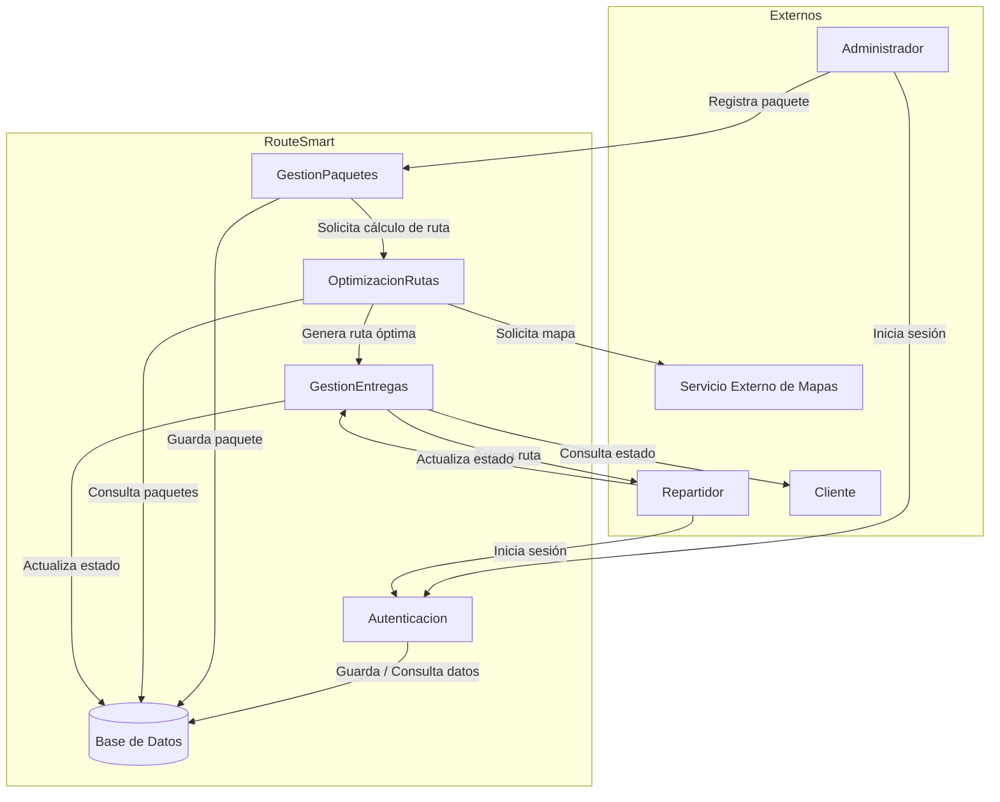

## Diagrama de Contexto – RouteSmart

```mermaid
graph TD

%% ===== ACTORES EXTERNOS =====
subgraph Externos
    Administrador
    Repartidor
    Cliente
    ServicioMapas[Servicio Externo de Mapas]
end

%% ===== SISTEMA ROUTESMART =====
subgraph RouteSmart
    Autenticacion
    GestionPaquetes
    OptimizacionRutas
    GestionEntregas
    BaseDatos[(Base de Datos)]
end

%% ===== AUTENTICACIÓN =====
Administrador -->|Inicia sesión| Autenticacion
Repartidor -->|Inicia sesión| Autenticacion
Autenticacion -->|Guarda / Consulta datos| BaseDatos

%% ===== GESTIÓN DE PAQUETES =====
Administrador -->|Registra paquete| GestionPaquetes
GestionPaquetes -->|Guarda paquete| BaseDatos

%% ===== OPTIMIZACIÓN DE RUTAS =====
GestionPaquetes -->|Solicita cálculo de ruta| OptimizacionRutas
OptimizacionRutas -->|Consulta paquetes| BaseDatos
OptimizacionRutas -->|Solicita mapa| ServicioMapas

%% ===== ENTREGAS =====
OptimizacionRutas -->|Genera ruta óptima| GestionEntregas
GestionEntregas -->|Asigna ruta| Repartidor
Repartidor -->|Actualiza estado| GestionEntregas
GestionEntregas -->|Actualiza estado| BaseDatos

%% ===== VISUALIZACIÓN CLIENTE =====
GestionEntregas -->|Consulta estado| Cliente
```
